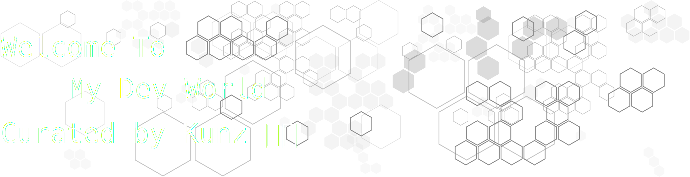

I am a versatile developer and designer specializing in creating efficient, user-friendly applications across multiple 
platforms. With a passion for problem-solving and innovative design, I thrive on delivering creative solutions that 
drive meaningful impact.

---

# `Languages & Tools`

---

| Category                                        | Languages & Tools                                                                                                                                                                                                                                                                                                                                                                                                                                                                                                                                                                                                                                                                                                                                                                                                                                                                                                                                                                                                                                                                                                                              |
|-------------------------------------------------|------------------------------------------------------------------------------------------------------------------------------------------------------------------------------------------------------------------------------------------------------------------------------------------------------------------------------------------------------------------------------------------------------------------------------------------------------------------------------------------------------------------------------------------------------------------------------------------------------------------------------------------------------------------------------------------------------------------------------------------------------------------------------------------------------------------------------------------------------------------------------------------------------------------------------------------------------------------------------------------------------------------------------------------------------------------------------------------------------------------------------------------------|
| **Markup Languages**                            |                                                                                                                                                                                                                                                                                                                                                                                                                                                                                                                                                                                                                                                                                                                                                                                                                                                                |
| **Programming Languages**                       |                                                                                                                                                                                                                                                                                                                    |
| **Query Languages**                             |                                                                                                                                                                                                                                                                                                                                                                                                                                                                                                                                                                                                                              |
| **Frameworks**                                  |            | 
| **Platforms & OS**                              |                                                                                                                                                                                                                                                                                                                                                                                                                                                                                                                                                                                                                                                                                                                                                                                                                                                                                                                                            |
| **Databases**                                   |                                                                                                                                                                                                                                                                                                                                                                |
| **Artificial Intelligence**                     |                                                                                                                                                                                                                                                                                                                                                                                                                                                                                                                                                                                                                                                                                                                                                                                                             |
| **Cloud**                                       |                                                                                                                                                                                                                                                                                                              |
| **Design**                                      |                                                                                                                                                                                                                                                                                                                                                                                                                                                   |
| **ETL**                                         |                                                                                                                                                                                                                                                                                                                                                                                                                                                                                                                                                                                                                                                                                                                                                                                                                                                                                                                                                                                                                                       |
| **Embedded Systems (IoT)** |                                                                                                                                                                                                                                                                                                                                                                                                                                                                                                                                                                                                                                                                                                                                                                                                                                                                                                                |

---
## Github Stat

## Games

<!-- Last Updated: --LAST_UPDATED-->

## Support My Work
If you enjoy what I do and would like to show your appreciation, consider buying me a coffee!

